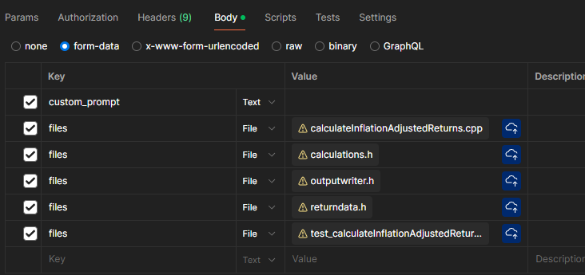

# Code Translation with Large Language Models using Ollama

This project is a **prototype system** that uses **Large Language Models (LLMs)** via **[Ollama](https://ollama.com/)** to automatically translate C++ code into Java.  
It is designed to be **modular**, **scalable**, and suitable for **enterprise integration**, acting as a **proof-of-concept** for future automation workflows.

## 🚀 Technologies Used

- `Python`
- `Docker` - Service Containerization
- [`FastAPI`](https://fastapi.tiangolo.com/) - Lightweight web framework for REST APIs
- [`RabbitMQ`](https://www.rabbitmq.com/) - Message queue for asynchronous task handling
- [`Ollama`](https://ollama.com/) - Local LLM backend
- `javac`, `PMD` - Java compiler and static code analyzer for post-translation validation

## 📦 Getting Started

### 1. Build all services

    
    docker compose build
    

### 2. Pull your preferred model

    
    docker exec -it ollama ollama pull qwen2.5-coder:7b
    

 Set the model in `.env`:

    
    LLM_MODEL=qwen2.5-coder:7b
    

### 3. Start all services

    
    docker compose up
    

### 4. Send a C++ file via `HTTP request`

#### POST Request Parameters

| Info| Key | Type | Value |
|---|-----|-----------|-------------|
| .cpp file | files | File | legacyCode.cpp |
| .h file | files | File | date.h
| .h file | files | File | currency.h
| ... | | |
| *(optional)*|custom_prompt | Text | The previous output missed a static nested helper class called Config. Ensure it’s static and public. |
| *(WIP)* test_.cpp file |files | File | test_legacyCode.cpp

#### using POSTMAN



#### using CURL
    
    curl -X POST http://localhost:8000/translate/ \
    -F "files=@path/to/legacyCode.cpp" \
    -F "files=@path/to/date.h" \
    -F "files=@path/to/currency.h" \ 
    -F "custom_prompt=The previous output missed a static nested helper class called Config. Ensure it’s static and public."
    -F "files=@path/to/test_legacyCode.cpp" \

## 🧱 System Architecture



## 🔧 Components

### **FastAPI Service (Frontend Interface)**
- Exposes an API endpoint at `/translate/`
- Accepts file uploads (`.cpp`, `.h`)
- Stores files at `/fastapi/uploads/`
- Sends jobs to RabbitMQ

### **RabbitMQ (Message Broker)**
- Buffers and routes translation tasks
- Decouples file upload from translation processing
- Holds queued translation jobs until a worker is ready
- Enables reliable and scalable task dispatching

### **Translation Worker (Core Logic)**
- Listens to the queue for new jobs
- Handles the complete translation pipeline:
  - Preprocessing of C++ files
  - Prompt-based translation via LLM
  - Compilation with `javac`
  - Retry logic using error feedback from java compiler
  - Outputs saved in `/output/`

### **Ollama (LLM Backend)**
- Hosts the local LLM model (e.g., `qwen2.5-coder:7b`)
- Receives structured prompts via `POST /api/generate`
- Returns translated Java code
- Easily replaceable with other local models

## 📄 Notes

- Existing files with the same name will be overwritten.

- Ollama currently supports a context window of 3500 tokens (default: 2048).


## 🛠 Debugging & Useful Commands

- General Docker commands:

  ```bash
  docker compose up --build -d              # detached mode
  docker logs translation_worker --follow   # show logs of specific service
  docker exec -it ollama sh                 # access Ollama container shell
  ollama list                               # list available models
  ```

- Test the LLM directly:

  ```bash
  curl -s -X POST http://localhost:11434/api/generate \
    -H "Content-Type: application/json" \
    -d '{"model": "qwen2.5-coder:7b", "prompt": "What is 1 + 1?", "stream": false}'
  ```
       
## 📚 Planned Features

- *(WIP)* *Test Worker*: Auto-generate unit tests post-translation

- *(WIP)* PMD Feedback Loop: Use static analysis to improve retry logic

- Support for additional language pairs (e.g., Python ⇄ Java)

- Cloud integration (e.g., PostgreSQL, S3)

- Enterprise fine-tuning of models

- Web UI for job monitoring and status tracking

## 📄 License

This project is part of a Bachelor Thesis in collaboration with Oesterreichische Kontrollbank AG (OeKB).
Licensed under the [MIT License](LICENSE). 
